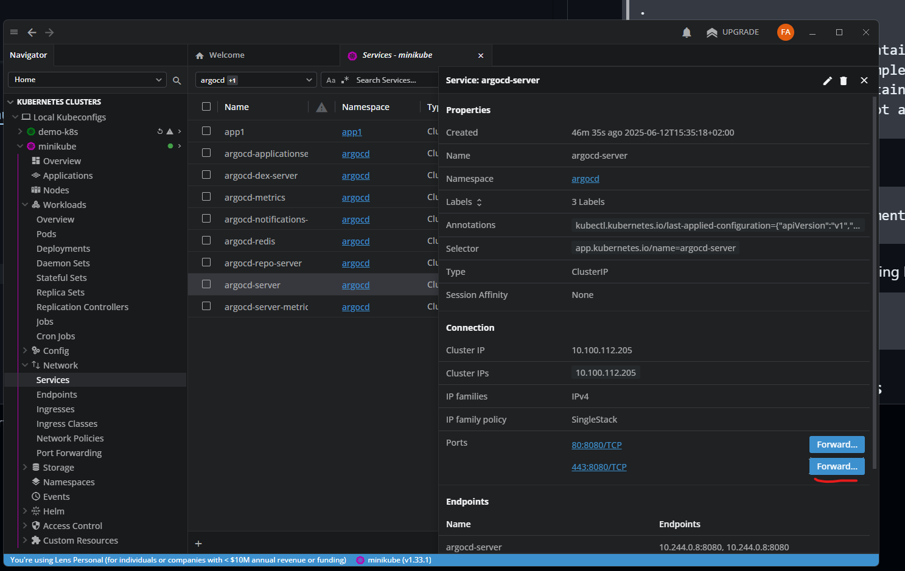
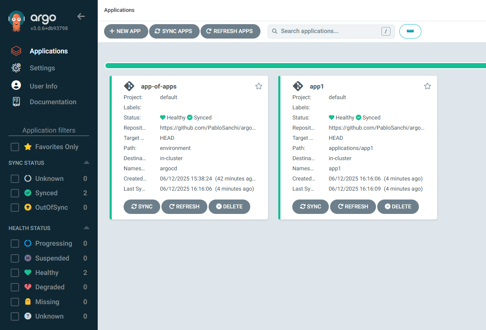
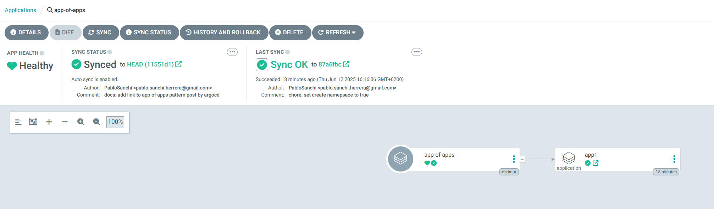
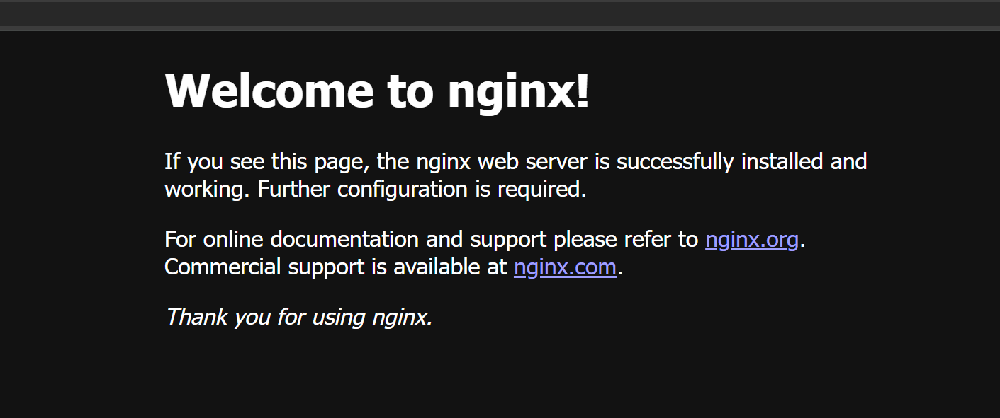

# ArgoCD App of Apps Pattern

This guide demonstrates how to set up ArgoCD using the [App of Apps pattern](https://argo-cd.readthedocs.io/en/latest/operator-manual/cluster-bootstrapping/#app-of-apps-pattern), which allows you to manage multiple applications through a single parent application. This pattern is particularly useful for managing multiple microservices or applications in a GitOps workflow.

> **Important Note**: This is a simplified demo setup. In a production environment, it's recommended to:
> - Separate the ArgoCD app-of-apps deployment into a dedicated infrastructure repository
> - Implement proper security measures and access controls
> - Use a more robust Kubernetes cluster setup
> - Configure proper backup and disaster recovery procedures

## Demo Environment

This demonstration was performed using:
- Operating System: Windows 11 with WSL enabled
- Local Kubernetes: Minikube
- Package Manager: Helm
- Container Runtime: Docker
- Kubernetes CLI: kubectl

## This demo was perfomed with the following machine specs:

The following tools are required:
- Windows 11 with WSL enabled
- Minikube (for local Kubernetes cluster)
- Helm (for package management)
- Docker (for container runtime)
- kubectl (for Kubernetes interaction)

> Note: the machine used is not imporant, and will not change how the demo is performed.

## Step-by-Step Installation Guide

### 1. Create a Local Kubernetes Cluster

Start a local Kubernetes cluster using Minikube:
```bash
minikube start --driver=docker
```

### 2. Install ArgoCD

1. Create a dedicated namespace for ArgoCD:
```bash
kubectl create namespace argocd
```

2. Verify the namespace creation:
```bash
kubectl get namespaces
```

3. Install ArgoCD using the official manifest:
```bash
kubectl apply -n argocd -f https://raw.githubusercontent.com/argoproj/argo-cd/stable/manifests/install.yaml
```

4. Verify that all ArgoCD pods are running:
```bash
kubectl get pods -n argocd
```

### 3. Access ArgoCD UI

You have two options to access the ArgoCD UI:

1. Using port forwarding:
```bash
kubectl port-forward svc/argocd-server -n argocd 8080:443
```
Then access the UI at `https://localhost:8080`

2. Using OpenLens (recommended):
- Install OpenLens
- Connect to your Minikube cluster
- Navigate to the ArgoCD namespace
- Expose `argocd-server` service



Default credentials:
- Username: `admin`
- Password: Get it using:
```bash
kubectl -n argocd get secret argocd-initial-admin-secret -o jsonpath="{.data.password}" | base64 -d
```

### 4. Repository Structure Setup

Create the following directory structure:
```
.
└── argocd-demo/
    ├── applications/    # Contains individual application Helm charts
    │   └── app1        # Example application
    ├── environment/    # Contains ArgoCD Application manifests
    └── app-of-apps.yaml # Root application manifest
```

1. Create the directories:
```bash
mkdir -p applications environment
```

2. Create an example application using Helm:
```bash
helm create applications/app1
```

### 5. Create Application Manifests

1. Create an ArgoCD Application manifest for `app1` in `environment/app1.yaml`:
```yaml
apiVersion: argoproj.io/v1alpha1
kind: Application
metadata:
  name: app1
  namespace: argocd
spec:
  project: default
  source:
    repoURL: https://github.com/<your-github-user>/<your-repo-name>
    targetRevision: HEAD
    path: applications/app1
    helm:
      valuesObject:
        replicaCount: 2
        image:
          tag: stable
  destination:
    server: https://kubernetes.default.svc
    namespace: app1
  syncPolicy:
    automated:
      prune: true
      selfHeal: true
    syncOptions:
      - CreateNamespace=true
```

2. Create the App of Apps manifest in `app-of-apps.yaml`:
```yaml
apiVersion: argoproj.io/v1alpha1
kind: Application
metadata:
  name: app-of-apps
  namespace: argocd
spec:
  project: default
  source:
    repoURL: https://github.com/<your-github-user>/<your-repo-name>
    targetRevision: HEAD
    path: environment
  destination:
    server: https://kubernetes.default.svc
    namespace: argocd
  directory:
    recurse: true
  syncPolicy:
    automated:
      prune: true
      selfHeal: true
```

### 6. Deploy the App of Apps

1. Push all changes to your GitHub repository:
```bash
git add .
git commit -m "Initial ArgoCD setup"
git push origin main
```

2. Apply the App of Apps manifest to your cluster:
```bash
kubectl apply -f app-of-apps.yaml
```

3. Result
- Argo applications overview dashboard

- App of Apps application view

- App1 nginx overview


## Understanding the App of Apps Pattern

The App of Apps pattern works as follows:

1. The root `app-of-apps.yaml` points to the `environment` directory
2. The `environment` directory contains individual application manifests
3. Each application manifest points to its corresponding Helm chart in the `applications` directory (or an external one)
4. ArgoCD automatically syncs all applications based on the manifests

This pattern provides several benefits:
- Centralized management of multiple applications
- Automated synchronization
- Self-healing capabilities
- GitOps workflow compliance
- Easy addition of new applications
